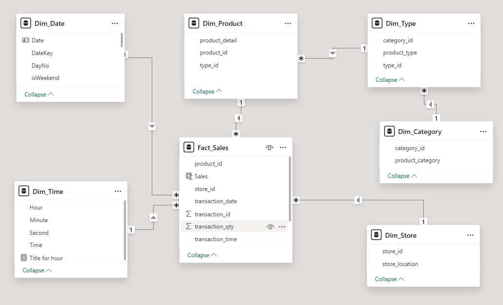
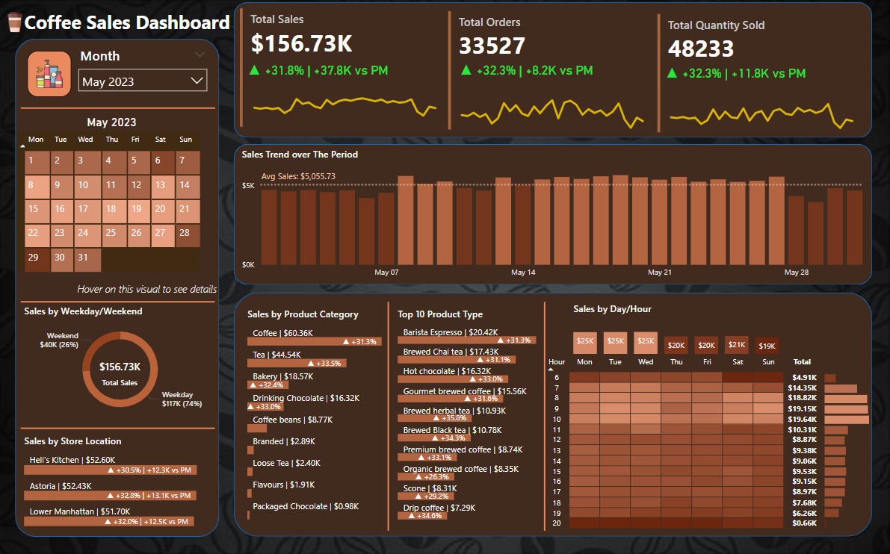
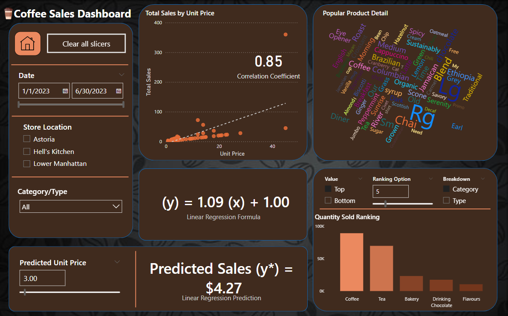

# ☕ Coffee Sales Analysis - Power BI Dashboard
## 📌 Project Overview
This Power BI project analyzes sales data for a coffee shop to provide actionable insights into various aspects of sales performance. The dashboard helps the business track total sales, order trends, and product performance across different locations and time periods.
## ❓ Problem Statement
The coffee shop is struggling to understand its sales performance. The key areas of concern include:
-	**Total Sales Analysis** - Understanding revenue trends.
-	**Total Order Analysis** - Monitoring order frequency.
-	**Total Quantity Sold Analysis** - Evaluating product demand.
-	**Sales Analysis by Weekdays and Weekends** - Comparing weekday vs. weekend performance.
-	**Sales Analysis by Store Location** - Identifying top-performing locations.
-	**Daily Sales with Average Line** - Tracking sales trends over time.
-	**Sales Analysis by Product Category** - Assessing which product categories drive the most revenue.
-	**Top 10 Products by Sales** - Identifying the best-selling items.
-	**Sales Analysis by Days and Hours** - Understanding peak sales periods.
  
The goal is to analyze these aspects to **identify key sales drivers and areas for improvement**.
## 🛠️ Skills Demonstrated
-	**Power BI** for data visualization, modeling, and analysis.
## 📊 Dataset Information
- Source: Excel file containing sales data.
- Key Columns:
  - Date
  - Product
  - Location
  - Sales Amount
  - Quantity Sold
  - Order ID
## 🔄 Data Transformation
To optimize performance and structure, **Power Query** was used to transform the raw dataset into a **star schema model**. The original dataset was broken down into:
-	**Fact Table**:
    -	Fact_Sales: Contains transactional sales data including transaction_id, product_id, store_id, transaction_date, transaction_time, and transaction_qty.   
-	**Dimension Tables** (created in Power Query):
    -	Dim_Type: Contains product type information.
    -	Dim_Category: Stores product category details.
    -	Dim_Store: Includes store locations.
    -	Dim_Product: Holds product details.
-	After applying transformations in Power Query and loading the data into **Power BI Desktop**, two additional dimension tables were added to support **time intelligence calculations**:
    -	Dim_Date: Contains Date, DateKey, DayNo, and isWeekend fields for date-based analysis.
    -	Dim_Time: Includes Hour, Minute, Second, and Time fields to enable time-based insights.
## 📐 Data Modeling
Below is the **star schema model** used in this project:
 
## 📈 Analysis & Visualizations
 
 
The Power BI dashboard consists of various visual elements to display insights:
1.	**Total Sales Analysis** - Card & Line Chart showing sales trends.
2.	**Total Order Analysis** - Card & Line Chart tracking order volume.
3.	**Total Quantity Sold Analysis** - Card & Line Chart for total product sales.
4.	**Sales Analysis by Weekdays and Weekends** - Pie Chart to compare sales on different days.
5.	**Sales Analysis by Store Location** - Bar Chart visualizing sales performance per location.
6.	**Daily Sales with Average Line** - Column Chart with an average trend line.
7.	**Sales Analysis by Product Category** - Bar Chart displaying category-wise revenue distribution.
8.	**Top 10 Products by Sales** - Bar Chart showing the best-selling items.
9.	**Sales Analysis by Days and Hours** - Matrix Chart analyzing sales peaks across different days and hours.
10.	**Calendar Map for Monthly & Day-wise Analysis** - Filtering sales data using a calendar map.
11.	**Tooltip in Calendar Map & Days-Hours Chart** - Interactive tooltips for more detailed insights.
## 📌 Conclusion & Recommendations
- **High Sales Days:** Sales peak during weekends and early morning hours.
- **Top Products:** The best-selling products are cappuccinos and espresso-based drinks.
- **Store Performance:** Some locations outperform others due to high foot traffic.
- **Promotional Strategy:** Offering discounts on slow-selling products can help balance demand.
## 🚀 How to Use This Dashboard
1.	Download the .pbix file from the repository.
2.	Open Power BI Desktop and load the file.
3.	Use filters and slicers to explore insights interactively.
___
🔗 For further improvements, feel free to fork this project and contribute! 🚀

